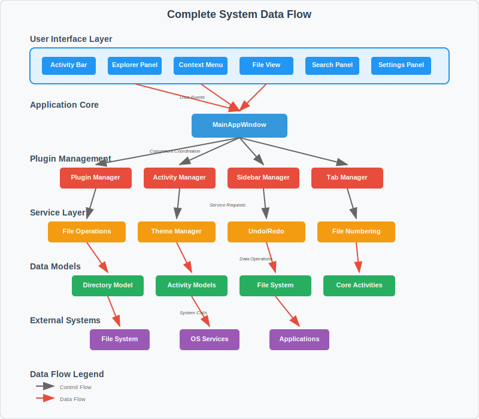

Architecture
============

This section describes the comprehensive architecture of the POEditor Plugin application, including core components, data flow, and system integration.

Architecture Components
-----------------------

The application is built using a modular, service-oriented architecture with the following key components:

**Plugin System**
  Core plugin management infrastructure with activity coordination

**Services Layer**  
  Business logic and data operation services

**Data Models**
  Application data structures and configuration management

**Widget System**
  UI components and user interface elements

**Storage Layer**
  Persistent storage and external system integration

.. toctree::
   :maxdepth: 2

   overview
   plugin_system
   activity_system
   services
   theme_system
   component_diagram

Architecture Documentation
--------------------------

.. container:: arch-cards

   .. container:: card

      .. figure:: ../_static/images/architecture_diagram.svg
         :alt: Plugin Architecture
         :width: 100%
         :figclass: align-center
         
      **Plugin System Architecture**
      
      Detailed view of the plugin management system, activity coordination, and component relationships.
      
      :doc:`plugin_system`

   .. container:: card

      .. figure:: ../_static/images/services_architecture.svg
         :alt: Services Architecture  
         :width: 100%
         :figclass: align-center
         
      **Services Architecture**
      
      Service layer design showing file operations, theme management, and core business services.
      
      :doc:`services`

   .. container:: card

      .. figure:: ../_static/images/themes.svg
         :alt: Theme System
         :width: 100%
         :figclass: align-center
         
      **Theme System**
      
      Theming architecture with CSS management and light/dark mode support.
      
      :doc:`theme_system`

Design Principles
-----------------

The architecture follows these key design principles:

**Modularity**
  Components are designed as independent modules with well-defined interfaces

**Extensibility**
  Plugin system allows for easy addition of new functionality

**Separation of Concerns**
  Clear boundaries between UI, business logic, and data layers

**Service Orientation**
  Core functionality is provided through reusable services

**Event-Driven Communication**
  Components communicate through events and signals for loose coupling

**Testability**
  Architecture supports unit testing and integration testing

This design ensures maintainability, scalability, and ease of development while providing a robust foundation for the POEditor Plugin application.
