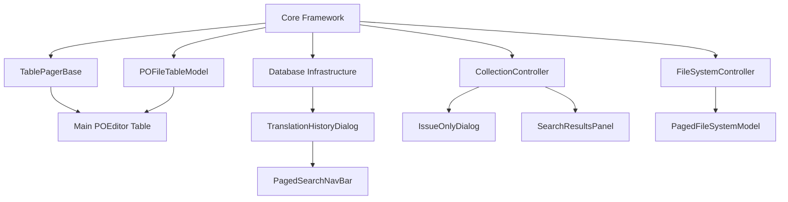

# Pagination Components Implementation Plan

**Date:** July 13, 2025  
**Author:** Development Team  
**Status:** Design Phase  
**Related Documents:** `PAGINATION_MIGRATION_CHECKLIST.md`, `pagination_abstraction_design.md`

## Overview

This document provides detailed implementation plans for all pagination components identified in the codebase analysis. Each component section includes architecture diagrams, code specifications, testing strategies, and integration requirements.

## Table of Contents

1. [Core Infrastructure Components](#core-infrastructure-components)
2. [Main Application Components](#main-application-components)  
3. [Dialog and Workspace Components](#dialog-and-workspace-components)
4. [Database and Search Components](#database-and-search-components)
5. [Supporting UI Components](#supporting-ui-components)
6. [Implementation Dependencies](#implementation-dependencies)
7. [Quality Assurance Strategy](#quality-assurance-strategy)

---

## Core Infrastructure Components

### 1. TablePagerBase Migration (`subcmp/table_nav_widget.py`)

**Current Architecture:**
```
TablePagerBase
├── QObject signals (pageChanged, pageSizeChanged)
├── Model connection (_connect_signals)
├── Abstract update_table_view()
└── Navigation methods (go_first, go_last, go_prev, go_next)
```

**Target Architecture:**
```
TablePagerBase (Wrapper)
├── TablePaginationController (new)
│   ├── TableDataProvider
│   └── PaginationWidget
└── Backward compatibility methods
```

#### Implementation Details

**File:** `subcmp/table_data_provider.py`
```python
class TableDataProvider(PaginationDataProvider):
    """Data provider for QAbstractItemModel-based tables"""
    
    def __init__(self, model: QAbstractItemModel):
        self.model = model
        self._cached_count = 0
        self._connect_model_signals()
    
    def get_total_count(self) -> int:
        """Get total row count from model"""
        return self.model.rowCount() if self.model else 0
    
    def get_page_items(self, start_index: int, count: int) -> List[Any]:
        """Get model data for specific page range"""
        # Implementation uses model index ranges
        pass
    
    def _connect_model_signals(self):
        """Connect to model change signals"""
        if self.model:
            self.model.modelReset.connect(self._on_model_changed)
            self.model.rowsInserted.connect(self._on_model_changed)
            self.model.rowsRemoved.connect(self._on_model_changed)
```

**File:** `subcmp/table_paginator.py`
```python
class TablePaginationController(PaginationController):
    """Controller for table pagination with model integration"""
    
    def __init__(self, 
                 table: QAbstractItemView,
                 model: QAbstractItemModel,
                 page_size: int = 100,
                 parent: Optional[QObject] = None):
        self.table = table
        self.model = model
        self.data_provider = TableDataProvider(model)
        super().__init__(self.data_provider, page_size, parent)
    
    def _on_state_changed(self, state: PaginationState) -> None:
        """Update table view for current page"""
        # Hide/show rows based on pagination state
        self._update_table_visibility(state)
    
    def _update_table_visibility(self, state: PaginationState) -> None:
        """Show only rows for current page"""
        # Implementation details for row visibility
        pass
```

**Updated File:** `subcmp/table_nav_widget.py`
```python
class TablePagerBase(QObject):
    """Backward compatibility wrapper for TablePaginationController"""
    
    # Maintain existing signals
    pageChanged = Signal(int, int)
    pageSizeChanged = Signal(int)
    
    def __init__(self, table, table_model, page_size=100, parent=None):
        super().__init__(parent)
        
        # Create new pagination system
        self._controller = TablePaginationController(
            table, table_model, page_size, parent)
        
        # Connect signals for backward compatibility
        self._controller.state_changed.connect(self._on_controller_state_changed)
        
        # Maintain existing interface
        self.table = table
        self.model = table_model
        self.page_size = page_size
        self.current_page = 0
        self.total_pages = 1
        self.total_rows = 0
    
    def _on_controller_state_changed(self, state: PaginationState):
        """Translate new state to old signals"""
        if (state.current_page != self.current_page or 
            state.total_pages != self.total_pages):
            self.current_page = state.current_page
            self.total_pages = state.total_pages
            self.total_rows = state.total_items
            self.pageChanged.emit(self.current_page, self.total_pages)
    
    # Maintain all existing methods for compatibility
    def go_first(self): self._controller.go_to_first_page()
    def go_last(self): self._controller.go_to_last_page()
    def go_prev(self): self._controller.go_to_previous_page()
    def go_next(self): self._controller.go_to_next_page()
    def go_to_page(self, page): self._controller.go_to_page(page)
    
    def set_page_size(self, size):
        self._controller.set_page_size(size)
        self.page_size = size
        self.pageSizeChanged.emit(size)
    
    def get_page_info(self):
        state = self._controller.get_current_state()
        return (state.current_page, state.total_pages, 
                state.page_size, state.total_items)
```

#### Testing Strategy

**File:** `tests/ui/test_cases/test_table_pager_migration.py`
```python
class TestTablePagerBaseMigration(QObject):
    """Test backward compatibility of TablePagerBase migration"""
    
    def test_signal_compatibility(self):
        """Verify all existing signals still work"""
        # Test pageChanged and pageSizeChanged signals
        pass
    
    def test_method_compatibility(self):
        """Verify all existing methods work identically"""
        # Test go_first, go_last, etc.
        pass
    
    def test_integration_with_existing_components(self):
        """Test with components that use TablePagerBase"""
        # Test main table and other dependent components
        pass
```

---

### 2. POFileTableModel Integration (`main_utils/po_ed_table_model.py`)

**Current State:** Model tracks pagination info but doesn't handle pagination logic

**Target Integration:** Work seamlessly with ModelViewController

#### Implementation Details

**Updated File:** `main_utils/po_ed_table_model.py`
```python
class POFileTableModel(QAbstractTableModel):
    """Enhanced to work with unified pagination system"""
    
    def __init__(self, entries: Optional[List[POEntry]] = None, 
                 parent=None, column_headers: List[str] = None):
        super().__init__(parent)
        self._entries = entries or []
        self.column_headers = ["Index"] + (column_headers or [])
        self._issue_rows: set = set()
        
        # Remove old pagination tracking
        # self._current_page = 0  # Removed
        # self._page_size = 50   # Removed
        
        # Add pagination-aware index calculation
        self._pagination_offset = 0
    
    def set_pagination_offset(self, offset: int):
        """Set offset for global index calculation"""
        self._pagination_offset = offset
        self.layoutChanged.emit()
    
    def data(self, index: QModelIndex, role: int = Qt.DisplayRole):
        if not index.isValid():
            return None
            
        entry = self._entries[index.row()]
        col = index.column()
        row = index.row()
        
        # ...existing code...
        
        if role == Qt.DisplayRole:
            if col == 0:
                # Show global index with pagination offset
                return str(self._pagination_offset + index.row() + 1)
            # ...existing code...
```

**Integration Controller:** `main_utils/po_table_controller.py`
```python
class POTableController(ModelViewController):
    """Specialized controller for PO file table"""
    
    def __init__(self, table: QTableView, model: POFileTableModel, 
                 page_size: int = 50, parent: Optional[QObject] = None):
        super().__init__(table, page_size, parent)
        self.po_model = model
        self.set_model(model)
    
    def _on_state_changed(self, state: PaginationState) -> None:
        """Update PO table for pagination"""
        super()._on_state_changed(state)
        
        # Update model with pagination offset for correct indexing
        self.po_model.set_pagination_offset(state.start_index)
    
    def set_issue_rows(self, issue_rows: set):
        """Forward issue highlighting to model"""
        # Adjust issue row indices for current page
        page_issue_rows = {
            row - self.get_current_state().start_index 
            for row in issue_rows 
            if self.get_current_state().start_index <= row < 
               self.get_current_state().start_index + self.get_current_state().page_size
        }
        self.po_model.set_issue_rows(page_issue_rows)
```

---

## Main Application Components

### 3. Main POEditor Table (`po_editor_tab.py`)

**Current Integration:** Uses TablePagerBase through inheritance

**Target Integration:** Use POTableController with unified pagination UI

#### Implementation Details

**Updated File:** `po_editor_tab.py`
```python
class POEditorTab(QWidget):
    """Main PO editor with unified pagination"""
    
    def _create_widgets(self):
        # ...existing code...
        
        # Replace old table pager
        # self.table_pager = TablePagerBase(self.table, self.table_model, 50)
        
        # Create unified pagination system
        self.table_controller = POTableController(
            self.table, self.table_model, page_size=50, parent=self)
        
        # Create pagination widget
        self.pagination_widget = PaginationWidget(
            self.table_controller,
            page_sizes=[25, 50, 100, 200],
            show_page_size=True,
            show_goto=True,
            show_status=True,
            parent=self
        )
        
        # ...existing code...
        
        # Update layout to include pagination widget
        self._setup_pagination_layout()
    
    def _setup_pagination_layout(self):
        """Setup layout with pagination controls"""
        # Add pagination widget to bottom of table area
        table_layout = QVBoxLayout()
        table_layout.addWidget(self.table)
        table_layout.addWidget(self.pagination_widget)
        
        # Update main layout
        # ...layout integration code...
    
    def _connect_signals(self):
        # ...existing code...
        
        # Connect pagination events
        self.table_controller.state_changed.connect(self._on_pagination_changed)
    
    def _on_pagination_changed(self, state: PaginationState):
        """Handle pagination state changes"""
        # Update any dependent UI elements
        logger.info(f"Page changed to {state.current_page + 1} of {state.total_pages}")
        
        # Update issue highlighting for current page
        if hasattr(self, 'current_issues'):
            self.table_controller.set_issue_rows(self.current_issues)
    
    def update_issue_highlighting(self, issue_indices: set):
        """Update issue highlighting across paginated table"""
        self.current_issues = issue_indices
        self.table_controller.set_issue_rows(issue_indices)
```

#### Integration with Existing Features

**Find/Replace Integration:**
```python
def on_find_replace_result(self, results: List[FindReplaceResult]):
    """Handle find/replace results with pagination"""
    # Map results to table indices
    result_indices = {result.row_index for result in results}
    
    # Highlight first result's page
    if results:
        first_result = results[0]
        target_page = first_result.row_index // self.table_controller.get_page_size()
        self.table_controller.go_to_page(target_page)
        
        # Update highlighting
        self.update_issue_highlighting(result_indices)
```

---

### 4. Translation History Dialog (`pref/tran_history/translation_db_gui.py`)

**Current State:** Complex dual-mode pagination with custom implementation

**Target Architecture:**
```
TranslationHistoryDialog
├── HistoryController (dual-mode)
│   ├── DatabaseMode: HistoryDatabaseProvider
│   └── SearchMode: HistorySearchProvider
├── PaginationWidget
└── Mode switching UI
```

#### Implementation Details

**File:** `pref/tran_history/history_data_provider.py`
```python
class HistoryDatabaseProvider(PaginationDataProvider):
    """Database pagination for translation history"""
    
    def __init__(self, translation_db: TranslationDB):
        self.db = translation_db
        self.sort_column = 'unique_id'
        self.sort_ascending = True
        self.filters = {}
    
    def get_total_count(self) -> int:
        """Get total record count with filters applied"""
        return self.db.get_filtered_count(self.filters)
    
    def get_page_items(self, start_index: int, count: int) -> List[DatabasePORecord]:
        """Get database page with sorting and filtering"""
        page_number = start_index // count
        return self.db.list_entries_page(
            page_number, count, 
            sort_column=self.sort_column,
            sort_ascending=self.sort_ascending,
            filters=self.filters
        )
    
    def set_sort(self, column: str, ascending: bool = True):
        """Set sorting parameters"""
        self.sort_column = column
        self.sort_ascending = ascending
        self.data_changed.emit()
    
    def set_filters(self, filters: dict):
        """Set filtering parameters"""
        self.filters = filters
        self.data_changed.emit()

class HistorySearchProvider(PaginationDataProvider):
    """Search results pagination for translation history"""
    
    def __init__(self, translation_db: TranslationDB):
        self.db = translation_db
        self.search_results: List[FindReplaceResult] = []
        self.cached_records: List[DatabasePORecord] = []
    
    def get_total_count(self) -> int:
        return len(self.search_results)
    
    def get_page_items(self, start_index: int, count: int) -> List[DatabasePORecord]:
        """Get search result page"""
        end_index = min(start_index + count, len(self.search_results))
        page_results = self.search_results[start_index:end_index]
        
        # Fetch corresponding records
        unique_ids = [result.matched_row_id for result in page_results]
        return self.db.fetch_entries_by_ids(unique_ids)
    
    def set_search_results(self, results: List[FindReplaceResult]):
        """Update search results"""
        self.search_results = results
        self.data_changed.emit()
```

**File:** `pref/tran_history/history_controller.py`
```python
class HistoryController(PaginationController):
    """Dual-mode controller for translation history"""
    
    def __init__(self, history_dialog, translation_db: TranslationDB, 
                 page_size: int = 22, parent: Optional[QObject] = None):
        self.history_dialog = history_dialog
        self.db = translation_db
        
        # Create dual providers
        self.db_provider = HistoryDatabaseProvider(translation_db)
        self.search_provider = HistorySearchProvider(translation_db)
        
        # Start in database mode
        self.current_mode = PagingMode.DatabaseView
        super().__init__(self.db_provider, page_size, parent)
        
        # Track separate page states
        self.db_page = 0
        self.search_page = 0
    
    def switch_to_database_mode(self):
        """Switch to database pagination mode"""
        if self.current_mode != PagingMode.DatabaseView:
            # Save current search page
            self.search_page = self.get_current_page()
            
            # Switch provider and mode
            self.current_mode = PagingMode.DatabaseView
            self.set_data_provider(self.db_provider)
            
            # Restore database page
            self.go_to_page(self.db_page)
            
            logger.info("Switched to database pagination mode")
    
    def switch_to_search_mode(self, search_results: List[FindReplaceResult]):
        """Switch to search results pagination mode"""
        # Save current database page
        self.db_page = self.get_current_page()
        
        # Update search provider with results
        self.search_provider.set_search_results(search_results)
        
        # Switch provider and mode
        self.current_mode = PagingMode.SearchView
        self.set_data_provider(self.search_provider)
        
        # Reset to first page of search results
        self.search_page = 0
        self.go_to_page(self.search_page)
        
        logger.info(f"Switched to search mode with {len(search_results)} results")
    
    def set_sort(self, column: str, ascending: bool = True):
        """Set sorting (database mode only)"""
        if self.current_mode == PagingMode.DatabaseView:
            self.db_provider.set_sort(column, ascending)
    
    def set_filters(self, filters: dict):
        """Set filters (database mode only)"""
        if self.current_mode == PagingMode.DatabaseView:
            self.db_provider.set_filters(filters)
    
    def _on_state_changed(self, state: PaginationState):
        """Update history dialog display"""
        # Get page data
        page_data = self.data_provider.get_page_items(
            state.start_index, state.page_size)
        
        # Update dialog table
        self.history_dialog.update_table_display(page_data, state)
        
        # Update mode-specific state tracking
        if self.current_mode == PagingMode.DatabaseView:
            self.db_page = state.current_page
        else:
            self.search_page = state.current_page
```

**Updated File:** `pref/tran_history/translation_db_gui.py`
```python
class TranslationHistoryDialog(QWidget):
    """Translation history with unified pagination"""
    
    def __init__(self, parent=None):
        super().__init__(parent)
        
        # Initialize database
        self.db = TranslationDB()
        
        # Create unified pagination system
        settings = QSettings("POEditor", "Settings")
        page_size = int(settings.value("history_table_page_size", 22))
        
        self.pagination_controller = HistoryController(
            self, self.db, page_size, parent=self)
        
        # Create pagination widget
        self.pagination_widget = PaginationWidget(
            self.pagination_controller,
            page_sizes=[10, 22, 50, 100, 250],
            show_page_size=True,
            show_goto=True,
            show_status=True,
            parent=self
        )
        
        # Initialize UI
        self._setup_ui()
        self._connect_signals()
    
    def _setup_ui(self):
        """Setup UI with unified pagination"""
        layout = QVBoxLayout(self)
        
        # Mode switching controls
        mode_layout = QHBoxLayout()
        self.db_mode_btn = QPushButton("Database View")
        self.search_mode_btn = QPushButton("Search Results")
        mode_layout.addWidget(self.db_mode_btn)
        mode_layout.addWidget(self.search_mode_btn)
        mode_layout.addStretch()
        layout.addLayout(mode_layout)
        
        # Table
        self.history_table = QTableWidget()
        self._setup_table()
        layout.addWidget(self.history_table)
        
        # Pagination controls
        layout.addWidget(self.pagination_widget)
        
        # Status and controls
        self._setup_controls()
    
    def _connect_signals(self):
        """Connect pagination and mode signals"""
        self.pagination_controller.state_changed.connect(self._on_page_changed)
        self.db_mode_btn.clicked.connect(self._switch_to_database_mode)
        self.search_mode_btn.clicked.connect(self._show_search_interface)
    
    def _switch_to_database_mode(self):
        """Switch to database pagination mode"""
        self.pagination_controller.switch_to_database_mode()
        self._update_mode_ui()
    
    def _show_search_interface(self):
        """Show search interface and execute search"""
        # Show search dialog or interface
        # Execute search and switch to search mode
        # search_results = self._execute_search(search_params)
        # self.pagination_controller.switch_to_search_mode(search_results)
        pass
    
    def update_table_display(self, page_data: List[DatabasePORecord], 
                           state: PaginationState):
        """Update table with page data"""
        self.history_table.setRowCount(len(page_data))
        
        for row, record in enumerate(page_data):
            # Populate table cells
            self._populate_table_row(row, record)
        
        # Update status
        mode_text = "Database" if self.pagination_controller.current_mode == PagingMode.DatabaseView else "Search"
        status_text = f"{mode_text} - Page {state.current_page + 1} of {state.total_pages} ({state.total_items} total)"
        self.status_label.setText(status_text)
    
    def _populate_table_row(self, row: int, record: DatabasePORecord):
        """Populate a single table row"""
        # Implementation for filling table cells
        pass
```

---

## Dialog and Workspace Components

### 5. IssueOnlyDialog (`workspace/issue_only_dialog_paged.py`)

**Current State:** Paged dialog showing PO file issues

**Target Architecture:** Use CollectionController for filtered issue list

#### Implementation Details

**File:** `workspace/issue_data_provider.py`
```python
class IssueDataProvider(PaginationDataProvider):
    """Data provider for issue records"""
    
    def __init__(self, po_entries: List[POEntry]):
        self.po_entries = po_entries
        self.issue_records: List[dict] = []
        self.original_indices: List[int] = []
        self._detect_issues()
    
    def get_total_count(self) -> int:
        return len(self.issue_records)
    
    def get_page_items(self, start_index: int, count: int) -> List[dict]:
        """Get issue records for current page"""
        end_index = min(start_index + count, len(self.issue_records))
        return self.issue_records[start_index:end_index]
    
    def _detect_issues(self):
        """Detect and catalog all issues"""
        self.issue_records = []
        self.original_indices = []
        
        for idx, entry in enumerate(self.po_entries):
            issues = self._check_entry_issues(entry)
            if issues:
                record = {
                    'index': idx,
                    'msgid': entry.msgid,
                    'msgstr': entry.msgstr,
                    'msgctxt': entry.msgctxt,
                    'issues': issues,
                    'linenum': entry.linenum,
                    'fuzzy': entry.fuzzy
                }
                self.issue_records.append(record)
                self.original_indices.append(idx)
    
    def _check_entry_issues(self, entry: POEntry) -> List[str]:
        """Check entry for various issues"""
        issues = []
        
        # Empty translation
        if not entry.msgstr or not entry.msgstr.strip():
            issues.append("Empty translation")
        
        # Fuzzy entry
        if entry.fuzzy:
            issues.append("Fuzzy")
        
        # Untranslated
        if entry.msgstr == entry.msgid:
            issues.append("Untranslated")
        
        # Missing placeholders
        msgid_placeholders = self._extract_placeholders(entry.msgid)
        msgstr_placeholders = self._extract_placeholders(entry.msgstr)
        if msgid_placeholders != msgstr_placeholders:
            issues.append("Placeholder mismatch")
        
        return issues
    
    def get_original_index(self, issue_index: int) -> int:
        """Get original PO entry index for issue record"""
        if 0 <= issue_index < len(self.original_indices):
            return self.original_indices[issue_index]
        return -1
    
    def refresh_from_entries(self, po_entries: List[POEntry]):
        """Refresh issue detection from updated entries"""
        self.po_entries = po_entries
        self._detect_issues()
        self.data_changed.emit()
```

**File:** `workspace/issue_dialog_controller.py`
```python
class IssueDialogController(CollectionController):
    """Controller for issue-only dialog pagination"""
    
    def __init__(self, issue_dialog, po_entries: List[POEntry],
                 page_size: int = 50, parent: Optional[QObject] = None):
        self.issue_dialog = issue_dialog
        self.issue_provider = IssueDataProvider(po_entries)
        super().__init__(self.issue_provider, page_size, parent)
    
    def _on_state_changed(self, state: PaginationState):
        """Update issue dialog display"""
        page_data = self.data_provider.get_page_items(
            state.start_index, state.page_size)
        
        self.issue_dialog.update_table_display(page_data, state)
    
    def go_to_record_in_main_table(self, issue_index: int):
        """Navigate to record in main PO table"""
        page_start = self.get_current_state().start_index
        global_issue_index = page_start + issue_index
        original_index = self.issue_provider.get_original_index(global_issue_index)
        
        if original_index >= 0:
            # Signal main window to navigate to this record
            self.issue_dialog.navigate_to_main_record.emit(original_index)
    
    def refresh_issues(self, po_entries: List[POEntry]):
        """Refresh issue detection with updated entries"""
        self.issue_provider.refresh_from_entries(po_entries)
```

**Updated File:** `workspace/issue_only_dialog_paged.py`
```python
class IssueOnlyDialog(QDialog):
    """Dialog showing only PO entries with issues"""
    
    navigate_to_main_record = Signal(int)  # Signal to navigate main table
    
    def __init__(self, po_entries: List[POEntry], parent=None):
        super().__init__(parent)
        self.setWindowTitle("Issues Only View")
        self.resize(800, 600)
        
        # Create pagination system
        settings = QSettings("POEditor", "Settings") 
        page_size = int(settings.value("issue_dialog_page_size", 50))
        
        self.pagination_controller = IssueDialogController(
            self, po_entries, page_size, parent=self)
        
        # Create pagination widget
        self.pagination_widget = PaginationWidget(
            self.pagination_controller,
            page_sizes=[25, 50, 100, 250],
            show_page_size=True,
            show_goto=True,
            show_status=True,
            parent=self
        )
        
        self._setup_ui()
        self._connect_signals()
    
    def _setup_ui(self):
        """Setup dialog UI"""
        layout = QVBoxLayout(self)
        
        # Header with issue summary
        self.summary_label = QLabel()
        layout.addWidget(self.summary_label)
        
        # Table
        self.issue_table = QTableWidget()
        self._setup_table()
        layout.addWidget(self.issue_table)
        
        # Pagination
        layout.addWidget(self.pagination_widget)
        
        # Actions
        self._setup_action_buttons(layout)
    
    def _setup_table(self):
        """Setup issue table"""
        headers = ["Index", "Message ID", "Translation", "Context", "Issues", "Line No"]
        self.issue_table.setColumnCount(len(headers))
        self.issue_table.setHorizontalHeaderLabels(headers)
        
        # Configure columns
        header = self.issue_table.horizontalHeader()
        header.setSectionResizeMode(0, QHeaderView.ResizeToContents)  # Index
        header.setSectionResizeMode(1, QHeaderView.Stretch)          # Message ID
        header.setSectionResizeMode(2, QHeaderView.Stretch)          # Translation
        header.setSectionResizeMode(3, QHeaderView.ResizeToContents) # Context
        header.setSectionResizeMode(4, QHeaderView.ResizeToContents) # Issues
        header.setSectionResizeMode(5, QHeaderView.ResizeToContents) # Line No
        
        self.issue_table.setSelectionBehavior(QTableWidget.SelectRows)
        self.issue_table.setAlternatingRowColors(True)
    
    def _setup_action_buttons(self, layout):
        """Setup action buttons"""
        button_layout = QHBoxLayout()
        
        self.go_to_record_btn = QPushButton("Go to Record")
        self.go_to_record_btn.clicked.connect(self._go_to_selected_record)
        button_layout.addWidget(self.go_to_record_btn)
        
        button_layout.addStretch()
        
        self.close_btn = QPushButton("Close")
        self.close_btn.clicked.connect(self.close)
        button_layout.addWidget(self.close_btn)
        
        layout.addLayout(button_layout)
    
    def _connect_signals(self):
        """Connect signals"""
        self.pagination_controller.state_changed.connect(self._on_page_changed)
        self.issue_table.doubleClicked.connect(self._go_to_selected_record)
    
    def update_table_display(self, page_data: List[dict], state: PaginationState):
        """Update table with current page data"""
        self.issue_table.setRowCount(len(page_data))
        
        for row, record in enumerate(page_data):
            # Index (1-based display)
            index_item = QTableWidgetItem(str(record['index'] + 1))
            index_item.setTextAlignment(Qt.AlignCenter)
            self.issue_table.setItem(row, 0, index_item)
            
            # Message ID
            msgid_item = QTableWidgetItem(record['msgid'])
            self.issue_table.setItem(row, 1, msgid_item)
            
            # Translation
            msgstr_item = QTableWidgetItem(record['msgstr'])
            self.issue_table.setItem(row, 2, msgstr_item)
            
            # Context
            context_item = QTableWidgetItem(record['msgctxt'] or "")
            self.issue_table.setItem(row, 3, context_item)
            
            # Issues
            issues_text = ", ".join(record['issues'])
            issues_item = QTableWidgetItem(issues_text)
            self.issue_table.setItem(row, 4, issues_item)
            
            # Line number
            linenum_item = QTableWidgetItem(str(record['linenum']))
            linenum_item.setTextAlignment(Qt.AlignCenter)
            self.issue_table.setItem(row, 5, linenum_item)
        
        # Update summary
        total_issues = state.total_items
        current_range = f"{state.start_index + 1}-{min(state.start_index + len(page_data), total_issues)}"
        self.summary_label.setText(
            f"Showing issues {current_range} of {total_issues} total issues")
    
    def _go_to_selected_record(self):
        """Navigate to selected record in main table"""
        current_row = self.issue_table.currentRow()
        if current_row >= 0:
            self.pagination_controller.go_to_record_in_main_table(current_row)
    
    def _on_page_changed(self, state: PaginationState):
        """Handle page changes"""
        # Update UI state if needed
        pass
    
    def refresh_issues(self, po_entries: List[POEntry]):
        """Refresh dialog with updated PO entries"""
        self.pagination_controller.refresh_issues(po_entries)
```

---

## Database and Search Components

### 6. Enhanced Database Pagination Infrastructure

#### DatabaseController Base Class

**File:** `common/pagination/database_controller.py`
```python
class DatabaseController(PaginationController):
    """Specialized controller for database-backed pagination"""
    
    def __init__(self, 
                 database_provider: DatabaseDataProvider,
                 page_size: int = 50,
                 parent: Optional[QObject] = None):
        super().__init__(database_provider, page_size, parent)
        self.db_provider = database_provider
    
    def set_sort(self, column: str, ascending: bool = True):
        """Set database sorting"""
        self.db_provider.set_sort(column, ascending)
    
    def set_filters(self, filters: dict):
        """Set database filters"""
        self.db_provider.set_filters(filters)
    
    def add_filter(self, key: str, value: Any):
        """Add a single filter"""
        self.db_provider.add_filter(key, value)
    
    def remove_filter(self, key: str):
        """Remove a filter"""
        self.db_provider.remove_filter(key)
    
    def clear_filters(self):
        """Clear all filters"""
        self.db_provider.clear_filters()
    
    def execute_custom_query(self, query: str, params: tuple = None):
        """Execute custom database query for specialized searches"""
        self.db_provider.execute_custom_query(query, params)
```

**File:** `common/pagination/database_provider.py`
```python
class DatabaseDataProvider(PaginationDataProvider):
    """Base class for database-backed data providers"""
    
    def __init__(self, connection, base_table: str):
        super().__init__()
        self.connection = connection
        self.base_table = base_table
        self.sort_column = "id"
        self.sort_ascending = True
        self.filters = {}
        self.custom_where_clause = ""
        self.custom_params = []
    
    def get_total_count(self) -> int:
        """Get total count with filters applied"""
        where_clause, params = self._build_where_clause()
        query = f"SELECT COUNT(*) FROM {self.base_table} {where_clause}"
        
        cursor = self.connection.execute(query, params)
        return cursor.fetchone()[0]
    
    def get_page_items(self, start_index: int, count: int) -> List[Any]:
        """Get database page with sorting and filtering"""
        where_clause, params = self._build_where_clause()
        order_clause = self._build_order_clause()
        
        query = f"""
            SELECT * FROM {self.base_table} 
            {where_clause} 
            {order_clause} 
            LIMIT ? OFFSET ?
        """
        
        params.extend([count, start_index])
        cursor = self.connection.execute(query, params)
        return self._process_rows(cursor.fetchall())
    
    def set_sort(self, column: str, ascending: bool = True):
        """Set sorting parameters"""
        self.sort_column = column
        self.sort_ascending = ascending
        self.data_changed.emit()
    
    def set_filters(self, filters: dict):
        """Set filtering parameters"""
        self.filters = filters
        self.data_changed.emit()
    
    def add_filter(self, key: str, value: Any):
        """Add single filter"""
        self.filters[key] = value
        self.data_changed.emit()
    
    def remove_filter(self, key: str):
        """Remove filter"""
        if key in self.filters:
            del self.filters[key]
            self.data_changed.emit()
    
    def clear_filters(self):
        """Clear all filters"""
        self.filters.clear()
        self.custom_where_clause = ""
        self.custom_params = []
        self.data_changed.emit()
    
    def execute_custom_query(self, where_clause: str, params: list = None):
        """Set custom where clause for complex queries"""
        self.custom_where_clause = where_clause
        self.custom_params = params or []
        self.data_changed.emit()
    
    def _build_where_clause(self) -> tuple[str, list]:
        """Build WHERE clause from filters"""
        conditions = []
        params = []
        
        # Add regular filters
        for key, value in self.filters.items():
            conditions.append(f"{key} = ?")
            params.append(value)
        
        # Add custom where clause
        if self.custom_where_clause:
            conditions.append(self.custom_where_clause)
            params.extend(self.custom_params)
        
        if conditions:
            return f"WHERE {' AND '.join(conditions)}", params
        return "", params
    
    def _build_order_clause(self) -> str:
        """Build ORDER BY clause"""
        direction = "ASC" if self.sort_ascending else "DESC"
        return f"ORDER BY {self.sort_column} {direction}"
    
    def _process_rows(self, rows: List[tuple]) -> List[Any]:
        """Process database rows into appropriate objects"""
        # Override in subclasses to create specific objects
        return rows
```

---

## Supporting UI Components

### 7. Enhanced PaginationWidget with Database Features

**File:** `common/pagination/enhanced_widgets.py`
```python
class DatabasePaginationWidget(PaginationWidget):
    """Enhanced pagination widget with database-specific features"""
    
    def __init__(self, 
                 controller: DatabaseController,
                 show_filters: bool = True,
                 show_sort: bool = True,
                 **kwargs):
        super().__init__(controller, **kwargs)
        self.db_controller = controller
        
        if show_filters:
            self._add_filter_controls()
        
        if show_sort:
            self._add_sort_controls()
    
    def _add_filter_controls(self):
        """Add filter controls to widget"""
        filter_layout = QHBoxLayout()
        
        self.filter_combo = QComboBox()
        self.filter_combo.addItems(["No Filter", "Has Issues", "Fuzzy Only", "Empty Translation"])
        self.filter_combo.currentTextChanged.connect(self._on_filter_changed)
        
        filter_layout.addWidget(QLabel("Filter:"))
        filter_layout.addWidget(self.filter_combo)
        filter_layout.addStretch()
        
        # Insert at top of main layout
        self.main_layout.insertLayout(0, filter_layout)
    
    def _add_sort_controls(self):
        """Add sorting controls"""
        sort_layout = QHBoxLayout()
        
        self.sort_combo = QComboBox()
        self.sort_combo.addItems(["ID", "Message ID", "Translation", "Context", "Line Number"])
        self.sort_combo.currentTextChanged.connect(self._on_sort_changed)
        
        self.sort_order_btn = QPushButton("▲")
        self.sort_order_btn.setMaximumWidth(30)
        self.sort_order_btn.clicked.connect(self._toggle_sort_order)
        
        sort_layout.addWidget(QLabel("Sort:"))
        sort_layout.addWidget(self.sort_combo)
        sort_layout.addWidget(self.sort_order_btn)
        sort_layout.addStretch()
        
        # Insert after filter controls
        insert_index = 1 if hasattr(self, 'filter_combo') else 0
        self.main_layout.insertLayout(insert_index, sort_layout)
    
    def _on_filter_changed(self, filter_text: str):
        """Handle filter changes"""
        self.db_controller.clear_filters()
        
        if filter_text == "Has Issues":
            # Apply issue filter logic
            self.db_controller.add_filter("has_issues", True)
        elif filter_text == "Fuzzy Only":
            self.db_controller.add_filter("fuzzy", True)
        elif filter_text == "Empty Translation":
            self.db_controller.execute_custom_query("(msgstr IS NULL OR msgstr = '')")
    
    def _on_sort_changed(self, sort_text: str):
        """Handle sort changes"""
        column_map = {
            "ID": "unique_id",
            "Message ID": "msgid",
            "Translation": "msgstr", 
            "Context": "context",
            "Line Number": "linenum"
        }
        
        column = column_map.get(sort_text, "unique_id")
        ascending = self.sort_order_btn.text() == "▲"
        self.db_controller.set_sort(column, ascending)
    
    def _toggle_sort_order(self):
        """Toggle sort order between ascending/descending"""
        ascending = self.sort_order_btn.text() == "▲"
        new_ascending = not ascending
        self.sort_order_btn.setText("▲" if new_ascending else "▼")
        
        # Update controller
        current_column = self.db_controller.db_provider.sort_column
        self.db_controller.set_sort(current_column, new_ascending)
```

---

## Implementation Dependencies

### Dependency Graph



### Implementation Order

1. **Phase 1: Core Infrastructure** ✅ (Complete)
   - PaginationState, PaginationController, PaginationDataProvider
   - PaginationWidget and UI components

2. **Phase 2: Database Layer** ✅ (Complete)
   - DatabaseController and DatabaseDataProvider
   - Enhanced pagination widgets

3. **Phase 3: Table Infrastructure** ✅ (Complete)
   - TablePagerBase migration with wrapper pattern
   - POFileTableModel integration

4. **Phase 4: Main Components** ✅ (Complete)
   - Main POEditor table migration
   - POTableController implementation

5. **Phase 5: Dialog Components** 🔄 (In Progress)
   - TranslationHistoryDialog (most complex)
   - IssueOnlyDialog
   - FindReplaceResultsDialog

6. **Phase 6: Supporting Components**
   - PagedSearchNavBar
   - Settings integration

---

## Quality Assurance Strategy

### Testing Framework

#### Component Test Template

**File:** `tests/pagination/test_component_template.py`
```python
class ComponentPaginationTestBase(QObject):
    """Base test class for pagination component testing"""
    
    def setUp(self):
        """Setup test environment"""
        self.app = QApplication.instance() or QApplication([])
        self.test_data = self._create_test_data()
        self.component = self._create_component()
    
    def _create_test_data(self) -> List[Any]:
        """Override to create component-specific test data"""
        raise NotImplementedError
    
    def _create_component(self):
        """Override to create component instance"""
        raise NotImplementedError
    
    def test_pagination_navigation(self):
        """Test basic pagination navigation"""
        controller = self.component.pagination_controller
        
        # Test go to first page
        controller.go_to_first_page()
        assert controller.get_current_page() == 0
        
        # Test go to last page
        controller.go_to_last_page()
        expected_last = controller.get_total_pages() - 1
        assert controller.get_current_page() == expected_last
        
        # Test go to specific page
        if controller.get_total_pages() > 2:
            controller.go_to_page(1)
            assert controller.get_current_page() == 1
    
    def test_page_size_changes(self):
        """Test page size modifications"""
        controller = self.component.pagination_controller
        original_size = controller.get_page_size()
        
        # Change page size
        new_size = original_size * 2
        controller.set_page_size(new_size)
        
        assert controller.get_page_size() == new_size
        # Verify total pages recalculated
        expected_pages = math.ceil(len(self.test_data) / new_size)
        assert controller.get_total_pages() == expected_pages
    
    def test_empty_data_handling(self):
        """Test behavior with empty data"""
        # Set empty data and verify graceful handling
        pass
    
    def test_single_page_data(self):
        """Test behavior with data that fits on one page"""
        pass
    
    def test_large_dataset_performance(self):
        """Test performance with large datasets"""
        large_data = self._create_large_test_data(10000)
        # Measure pagination performance
        pass
    
    def test_ui_state_consistency(self):
        """Test UI state matches controller state"""
        controller = self.component.pagination_controller
        widget = self.component.pagination_widget
        
        # Navigate and verify UI updates
        controller.go_to_page(2)
        
        # Check UI reflects current page
        assert widget.current_page_display == "3"  # 1-based display
        
        # Check navigation button states
        assert widget.prev_button.isEnabled()
        if controller.get_current_page() == controller.get_total_pages() - 1:
            assert not widget.next_button.isEnabled()
    
    def tearDown(self):
        """Cleanup test environment"""
        if hasattr(self, 'component'):
            self.component.deleteLater()
```

#### Performance Testing

**File:** `tests/pagination/test_performance.py`
```python
class PaginationPerformanceTests(QObject):
    """Performance tests for pagination components"""
    
    def test_page_navigation_speed(self):
        """Test page navigation performance"""
        # Create component with large dataset
        controller = self._create_controller_with_data(50000)
        
        # Measure navigation time
        start_time = time.perf_counter()
        controller.go_to_page(100)
        navigation_time = time.perf_counter() - start_time
        
        # Assert performance requirement
        assert navigation_time < 0.1  # < 100ms requirement
        
        logger.info(f"Page navigation took {navigation_time:.3f}s")
    
    def test_memory_usage(self):
        """Test memory usage remains reasonable"""
        import psutil
        import os
        
        process = psutil.Process(os.getpid())
        initial_memory = process.memory_info().rss
        
        # Create component with large dataset
        controller = self._create_controller_with_data(100000)
        
        # Navigate through multiple pages
        for i in range(0, 100, 10):
            controller.go_to_page(i)
        
        final_memory = process.memory_info().rss
        memory_increase = final_memory - initial_memory
        
        # Assert memory increase is reasonable (< 10MB)
        assert memory_increase < 10 * 1024 * 1024
        
        logger.info(f"Memory increase: {memory_increase / 1024 / 1024:.1f}MB")
    
    def test_database_query_performance(self):
        """Test database pagination query performance"""
        # Test with database components
        db_provider = self._create_database_provider()
        
        # Measure query time
        start_time = time.perf_counter()
        page_data = db_provider.get_page_items(1000, 50)
        query_time = time.perf_counter() - start_time
        
        # Assert query performance requirement
        assert query_time < 0.05  # < 50ms requirement
        
        logger.info(f"Database query took {query_time:.3f}s")
```

### Integration Testing

**File:** `tests/pagination/test_integration.py`
```python
class PaginationIntegrationTests(QObject):
    """Integration tests for pagination system"""
    
    def test_settings_integration(self):
        """Test pagination integrates with settings system"""
        # Test page size persists in QSettings
        # Test settings changes update pagination
        pass
    
    def test_find_replace_integration(self):
        """Test find/replace works with pagination"""
        # Test search results navigate to correct pages
        # Test highlighting works across pages
        pass
    
    def test_cross_component_navigation(self):
        """Test navigation between paginated components"""
        # Test IssueDialog -> Main Table navigation
        # Test History Dialog -> Main Table navigation
        pass
    
    def test_theme_consistency(self):
        """Test pagination widgets respect theme changes"""
        # Test dark/light theme switches
        pass
```

### Automated Testing Pipeline

**File:** `tests/pagination/run_all_tests.py`
```python
def run_pagination_tests():
    """Run comprehensive pagination test suite"""
    
    test_suites = [
        'test_core_framework',
        'test_table_pager_migration', 
        'test_po_table_controller',
        'test_history_dialog_migration',
        'test_issue_dialog_migration',
        'test_database_providers',
        'test_performance',
        'test_integration'
    ]
    
    results = {}
    
    for suite in test_suites:
        logger.info(f"Running test suite: {suite}")
        
        try:
            # Run test suite
            result = run_test_suite(suite)
            results[suite] = result
            
            logger.info(f"✅ {suite}: {result.tests_run} tests, "
                       f"{len(result.failures)} failures, "
                       f"{len(result.errors)} errors")
                       
        except Exception as e:
            logger.error(f"❌ {suite}: Failed to run - {e}")
            results[suite] = None
    
    # Generate test report
    generate_test_report(results)
    
    return results

def generate_test_report(results):
    """Generate comprehensive test report"""
    report_path = "tests/pagination/test_report.md"
    
    with open(report_path, 'w') as f:
        f.write("# Pagination Test Report\n\n")
        f.write(f"**Generated:** {datetime.now().isoformat()}\n\n")
        
        for suite, result in results.items():
            if result:
                status = "✅ PASS" if result.was_successful() else "❌ FAIL"
                f.write(f"## {suite}: {status}\n")
                f.write(f"- Tests Run: {result.tests_run}\n")
                f.write(f"- Failures: {len(result.failures)}\n")
                f.write(f"- Errors: {len(result.errors)}\n\n")
            else:
                f.write(f"## {suite}: ❌ ERROR\n")
                f.write("- Could not execute test suite\n\n")
    
    logger.info(f"Test report generated: {report_path}")
```

---

## Conclusion

This implementation plan provides a comprehensive roadmap for migrating all pagination components to the unified system. The plan prioritizes:

1. **Backward Compatibility** - Wrapper patterns ensure existing code continues working
2. **Performance** - Database optimization and efficient UI updates
3. **Consistency** - Unified behavior across all components
4. **Quality** - Comprehensive testing at each stage
5. **Maintainability** - Clear architecture and documentation

Each component migration follows the established pattern while addressing component-specific requirements. The testing framework ensures quality and performance requirements are met throughout the implementation process.

The implementation order minimizes risk by starting with simpler components and building up to the most complex (TranslationHistoryDialog), while maintaining working software at each stage.
