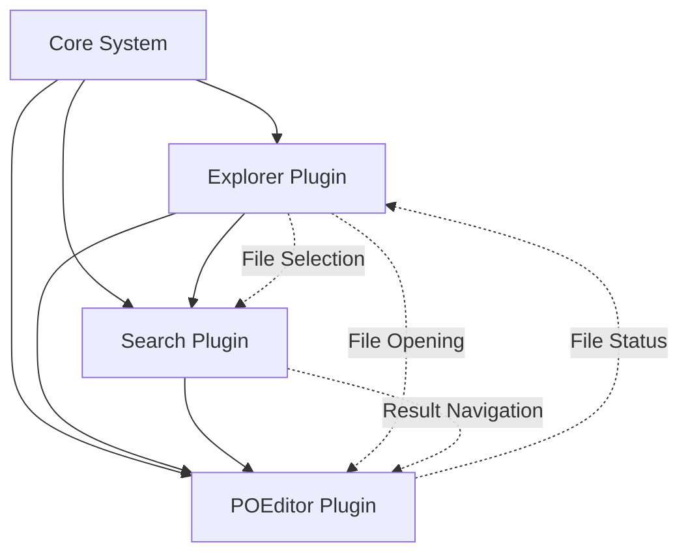

# Core Plugins Overview

## Introduction
This document provides an overview of the three core plugins that form the foundation of the POEditor application: Explorer, Search, and POEditor. These plugins work together to provide a comprehensive translation editing environment following the plugin architecture established in the core system.

## Plugin Architecture Integration

### Common Design Patterns
All three core plugins follow consistent design patterns:

1. **Plugin Entry Point:** Each plugin has a main plugin.py file that handles registration/unregistration with the PluginAPI
2. **UI Components:** Modular UI widgets that can be independently tested and maintained
3. **Service Integration:** Leverages core services (Configuration, Event, File, Logging) for common functionality
4. **Event-Driven Communication:** Plugins communicate through the EventService for loose coupling
5. **Configuration Management:** Plugin-specific settings namespaced under plugin names

### Plugin Interdependencies



## Core Plugins Overview

### 1. Explorer Plugin
**Primary Role:** File system navigation and workspace management

**Key Features:**
- File tree view with PO file detection
- Workspace management and project organization
- File operations (create, delete, rename, copy)
- PO file status indicators (translation progress)
- Integration with system file manager

**Sidebar Panel:** Always visible file explorer panel
**Commands:** File operations, navigation, workspace management
**Events:** File selection, workspace changes, file operations

### 2. Search Plugin
**Primary Role:** Global search and replace across workspace

**Key Features:**
- Workspace-wide text search with regex support
- PO-specific search (msgid, msgstr, comments)
- Find and replace with preview and batch operations
- Search result navigation and file opening
- Search history and saved patterns

**Sidebar Panel:** Search interface with results display
**Commands:** Search operations, navigation, replace functions
**Events:** Search execution, result selection, replace operations

### 3. POEditor Plugin
**Primary Role:** Specialized PO file editing and translation

**Key Features:**
- PO file parsing and editing interface
- Translation entry management with filtering
- Real-time validation and quality checks
- Translation progress tracking and statistics
- Plural forms and context handling

**Tab Interface:** Main editing interface for PO files
**Commands:** Translation operations, navigation, validation
**Events:** Translation changes, file modifications, validation results

## Integration Workflows

### File-to-Editor Workflow
1. **Explorer → POEditor:**
   - User navigates file tree in Explorer
   - Double-clicks PO file
   - Explorer emits `explorer.file_opened` event
   - POEditor receives event and opens file in new tab
   - Tab system manages multiple open files

2. **Search → POEditor:**
   - User performs search in Search plugin
   - Search results show matches in PO files
   - User clicks search result
   - Search emits `search.result_selected` event
   - POEditor opens file and navigates to specific entry

### Cross-Plugin Communication Examples

#### File Status Updates
```python
# POEditor saves file
api.emit_event("poeditor.file_saved", {
    "file_path": "/path/to/messages.po",
    "statistics": {"translated": 85, "total": 100}
})

# Explorer receives event and updates file status
def on_file_saved(self, event_data):
    self.update_file_status(event_data["file_path"], event_data["statistics"])
```

#### Search Integration
```python
# Search plugin finds PO content
api.emit_event("search.result_selected", {
    "file_path": "/path/to/messages.po",
    "line_number": 42,
    "entry_id": "greeting_message"
})

# POEditor receives event and navigates to entry
def on_search_result_selected(self, event_data):
    self.open_file_and_navigate(event_data["file_path"], event_data["entry_id"])
```

## Shared UI Patterns

### Consistent Visual Design
All plugins follow the established dark theme and visual patterns:

- **Color Scheme:** Dark background (#2d2d30) with light text (#cccccc)
- **Icons:** Consistent icon set for actions and file types
- **Fonts:** Source Code Pro for code/text areas, system font for UI
- **Spacing:** 8px grid system for consistent layouts
- **Status Indicators:** Common color coding (green=good, yellow=warning, red=error)

### Common UI Components
- **Toolbars:** Consistent button styling and grouping
- **Search Boxes:** Standardized search input with options
- **Status Bars:** Common format for progress and statistics
- **Context Menus:** Consistent menu structure and actions
- **Progress Indicators:** Unified progress display patterns

## Configuration Coordination

### Shared Settings
Some settings affect multiple plugins:

```python
# Shared in "ui" namespace
ui_config = {
    "theme": "dark",
    "font_family": "Source Code Pro",
    "font_size": 11,
    "icon_size": 16,
    "auto_save": True,
    "auto_save_interval": 30
}

# Plugin-specific settings in plugin namespaces
explorer_config = {
    "show_hidden_files": False,
    "auto_refresh": True,
    "po_progress_indicators": True
}

search_config = {
    "max_results": 10000,
    "case_sensitive": False,
    "po_search_enabled": True
}

poeditor_config = {
    "validation_enabled": True,
    "plurals_side_by_side": True,
    "translator_name": "User Name"
}
```

### Configuration Synchronization
Plugins listen for configuration changes that affect them:

```python
# All plugins listen for UI theme changes
api.register_event_handler("config.ui.theme_changed", self.on_theme_changed)

# POEditor listens for font changes that affect editor
api.register_event_handler("config.ui.font_changed", self.update_editor_font)
```

## Command Integration

### Cross-Plugin Commands
Some commands span multiple plugins:

```python
# Explorer can trigger search in current folder
api.register_command("explorer.search_folder", self.search_current_folder)

# Search can reveal results in Explorer
api.register_command("search.reveal_in_explorer", self.reveal_file_in_explorer)

# POEditor can open containing folder in Explorer
api.register_command("poeditor.show_in_explorer", self.show_file_in_explorer)
```

### Keyboard Shortcuts
Consistent keyboard shortcuts across plugins:

- **Ctrl+Shift+E:** Focus Explorer panel
- **Ctrl+Shift+F:** Focus Search panel
- **Ctrl+O:** Open file (handled by Explorer)
- **Ctrl+S:** Save current file (handled by active tab)
- **F3/Shift+F3:** Next/Previous search result
- **Ctrl+G:** Go to line/entry

## Error Handling Coordination

### Shared Error Patterns
All plugins use consistent error handling:

1. **User-Friendly Messages:** Clear, actionable error descriptions
2. **Graceful Degradation:** Continue operation when possible
3. **Error Recovery:** Provide recovery options where applicable
4. **Logging Coordination:** Use shared logging service for debugging

### Cross-Plugin Error Scenarios
- **File Access Errors:** Explorer detects, Search and POEditor handle gracefully
- **File Format Errors:** POEditor validates, Explorer shows status, Search excludes
- **Workspace Errors:** Explorer handles, other plugins adapt to limitations

## Performance Considerations

### Resource Sharing
Plugins coordinate to avoid resource conflicts:

- **File Watching:** Shared file system monitoring to avoid duplication
- **Memory Management:** Coordinated caching strategies
- **Background Processing:** Shared thread pool for non-UI operations

### Optimization Strategies
- **Lazy Loading:** Only load data when needed
- **Event Batching:** Group related events to reduce processing
- **Caching Coordination:** Share cached data between plugins when appropriate

## Testing Strategy

### Integration Testing
Test scenarios that span multiple plugins:

1. **File Operation Flow:** Explorer → POEditor → Save → Explorer update
2. **Search Navigation:** Search → Result selection → POEditor navigation
3. **Configuration Changes:** UI settings → All plugins update
4. **Error Propagation:** File error → All plugins handle gracefully

### End-to-End Testing
Real workflow scenarios:

1. **Translation Workflow:** Open project → Search for untranslated → Edit → Save
2. **Quality Assurance:** Search for errors → Fix in editor → Validate → Export
3. **Project Management:** Import files → Organize in Explorer → Batch operations

## Future Enhancements

### Plugin Ecosystem Expansion
The three core plugins provide a foundation for additional plugins:

- **Git Plugin:** Version control integration with all three core plugins
- **Translation Memory Plugin:** Enhanced translation suggestions for POEditor
- **Project Management Plugin:** Higher-level project coordination
- **Import/Export Plugin:** Advanced file format support
- **Collaboration Plugin:** Multi-user editing and review workflows

### Advanced Integration Features
- **Unified Command Palette:** VS Code-style command interface
- **Smart Suggestions:** Cross-plugin context awareness
- **Workflow Automation:** Scripting and automation capabilities
- **Analytics Dashboard:** Translation progress and productivity metrics

## Implementation Priority

### Phase 3: Core Plugins (Current Phase)
1. **Explorer Plugin:** File system foundation
2. **POEditor Plugin:** Core editing functionality  
3. **Search Plugin:** Navigation and find/replace

### Phase 4: Enhanced Features
1. **Advanced validation in POEditor**
2. **Project management in Explorer**
3. **Saved searches and patterns**

### Phase 5: Integration Features
1. **Cross-plugin workflows**
2. **Advanced automation**
3. **Performance optimizations**

This plugin ecosystem provides a solid foundation for the POEditor application while maintaining the flexibility to add new functionality through additional plugins.
